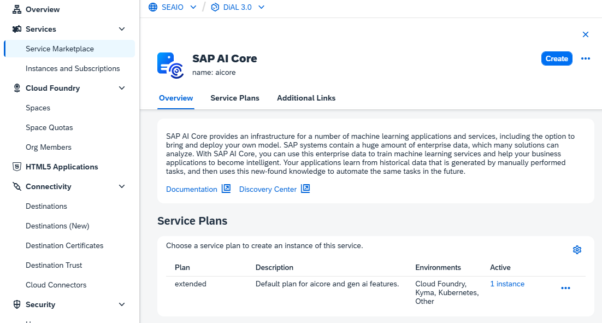
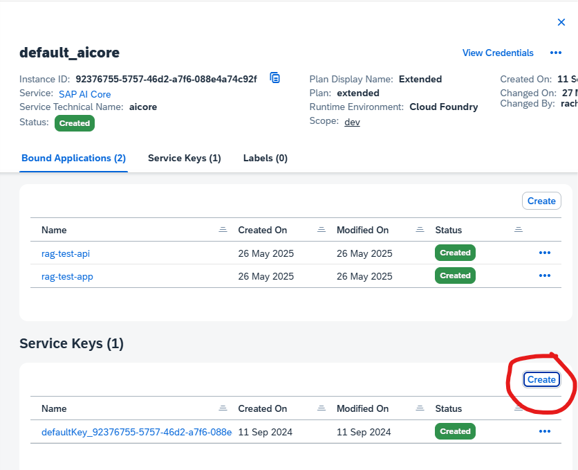
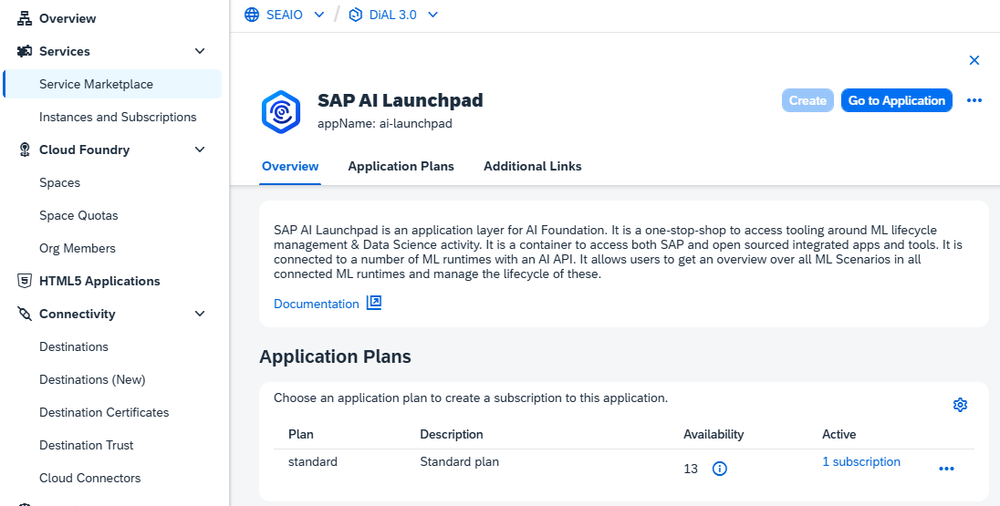
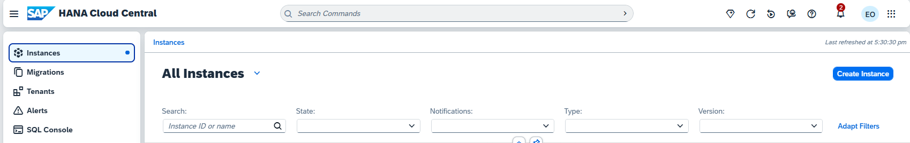
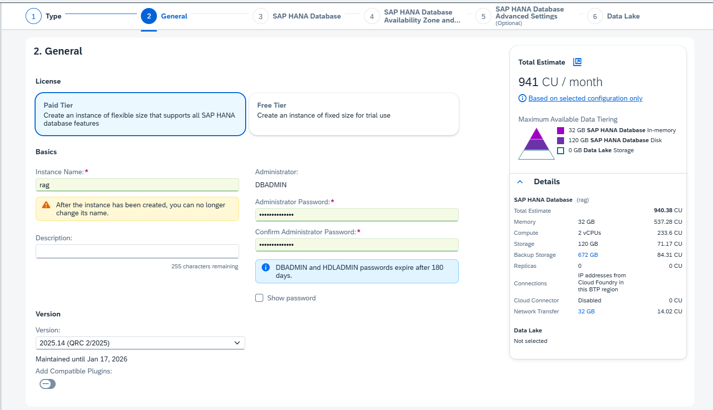
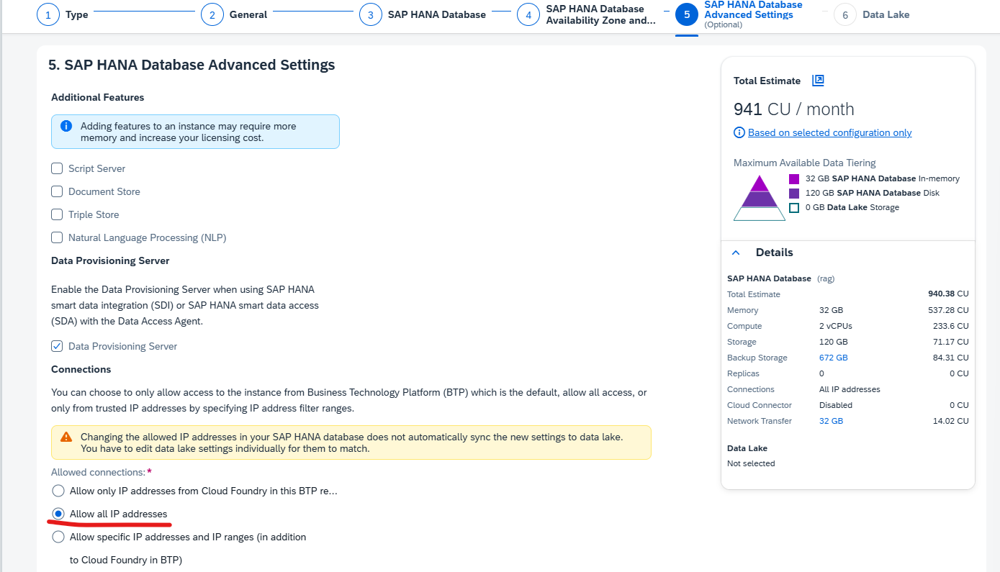

# Setup SAP BTP Cockpit 

In this section, we will be setting up your BTP Cockpit to allow for connectivity with **AI Launchpad, Document Extraction, SAP HANA Cloud and S3 Object Store.** Thereafter in the next section, we will proceed to modify the sample_env.txt file with the required keys. 

## STEP 1: Open SAP Business Technology Platform

👉 Open SAP [BTP Cockpit](https://emea.cockpit.btp.cloud.sap/cockpit).

👉 Navigate to your subaccount. If creating a new subaccount, ensure region chosen allows provisioning of all pre-requisite services. [View Regions to see more](https://help.sap.com/docs/btp/sap-business-technology-platform/regions).

## STEP 2: Open SAP AI Launchpad and connect to SAP AI Core

👉 Go to Instances and Subscriptions.

Check whether you see an SAP AI Core service instance and an SAP AI Launchpad application subscription. Ensure your AI Core service instance runs on the ``extended`` plan to access capailities of Generative AI Hub.

> SAP AI Launchpad is a centralised platform for AI lifecycle managemenet. We will be using it to deploy our LLM models for chunking and embedding conversion. 

### STEP 2.1: Create AI Core instance & AI Launchpad subscription 

👉 If you haven't created an AI Core instance, go to Service Marketplace and search for SAP AI Core -> Click Create, choose ``extended`` plan, Cloud Foundry runtime environment and give it an instance name. -> Create instance 

👉 Click into the new AI Core instance you've created, if there's no service key already, click create a new one and give your service key a name. No need to input any JSON, just click Create.

👉 If you haven't created an AI Launchpad Subscription, go to Service Marketplace and search for SAP AI Launchpad -> Click Create

## STEP 3: Connect to Document Information Extraction Service 

👉 Go to Instances and Subscriptions.

Check whether you see an Document Information Extraction instance as well as subscription. Ensure your Document Information Extraction service instance runs on the ``premium_edition`` plan to process custom documents using generative AI.

### STEP 3.1: Create Document Information Extraction Service instance & subscription

👉 If you haven't created an Document Information Extraction instance, go to Service Marketplace and search for Document Information Extraction -> Click Create, choose service plan of ``premium_edition`` and click create. 

👉 For new Subscription, go to Service Marketplace and search for Document Information Extraction -> Click Create, choose subscription plan of ``default`` and click create. 

## STEP 4: Connect to SAP HANA Cloud

👉 Go to Instances and Subscriptions.

Check whether you see an SAP HANA Cloud instance as well as subscription.

> If your HANA Cloud instance runs on `free` plan. Note that free-tier instances stop each evening and are deleted if inactive for 30 days. To avoid deletion, restart your instance within 30 days. `hana` instance is the paid tier, it holds permenant storage.

👉 If you haven't created an SAP HANA Cloud subscription, go to Service Marketplace and search for SAP HANA Cloud -> Click Create, choose subscription plan of ``tools`` and click create. 

### STEP 4.1: Create SAP HANA Cloud instance & subscription

We will create the SAP HANA Cloud instance within the SAP HANA Cloud Application, not BTP Cockpit. 

👉 Enter the SAP HANA Cloud Application. Create instance -> Choose type as "***SAP HANA Cloud, SAP HANA Database***" -> We recommend choosing Cloud Foundry as the runtime environment if you're planning to deploy your RAG App on CF -> Click ***Next Step***

👉 Click either Paid or Free tier depending on your needs and fill in necessary fields. Note that you are unable to view your password after creation. So save it somewhere safe for future reference. -> Click ***Next Step*** all the way till Step 5 

👉 Change Connections to ***Allow all IP addresses*** -> Click ***Create Now*** button at bottom of the screen

## STEP 5: Create Object Store instance and service key

👉 Go to Service Marketplace and search for Object Store -> Click Create, choose service plan of ``s3-standard``, runtime environment of Cloud Foundry, input an instance name and click create. 

👉 Go to Instances and Subscriptions. Under Instances, click into your object store instance -> Create new service key, give it a service key name and click create.  

[Next Exercise](2-Setting-up-env-file.md)