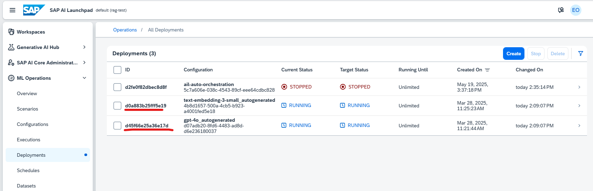

# Setup .env file 

In this section, we will be inputting in the required service instance keys for the application to run into our .env file.

## STEP 1: Renaming .env file 

👉 Under your root folder, rename the ``sample_env.txt`` file to ``.env``. This allows all environment variables to be loaded into the application using the dotenv library.

## STEP 2: Retrieving SAP HANA Cloud environment variables 

👉 Click into SAP HANA Cloud Application. Click into your instance. Under ***Connections***, you should be able to see your SQL Endpoint as well as your port. 

👉 Map ***SQL Endpoint*** into ``Hostname`` in your .env file. 
    Map ***Port*** into ``Port`` in your .env file. 
    Map ***Database User*** into ``HANA_USERNAME`` in your .env file. 
    Type password you used to create this HANA instance into ``Password`` in your .env file. 

## STEP 3: Deploy LLM Models & Retrieve deployment ID

👉 In your BTP Cockpit, click into your AI Launchpad application. 

👉 Create a new Resource Group using this [tutorial](https://help.sap.com/docs/ai-launchpad/sap-ai-launchpad/create-resource-group)

> SAP AI Core tenants use [resource groups](https://help.sap.com/docs/sap-ai-core/sap-ai-core-service-guide/resource-groups) to isolate related ML resources and workloads. Scenarios, executables, and Docker registry secrets are shared across all resource groups.

### Step 3.1: Deploy OpenAI Models as LLM & Embeddings 

👉 Under Model Library in AI Launchpad, search for any OpenAI models, click on the one you would like to deploy and press ***Deploy*** on the top right corner. It takes a minute or so to be deployed. 

> You could also deploy other LLM Models. However in this app we are using the ``gen_ai_hub.proxy.langchain.openai`` SDK to access our LLM and embeddings hence OpenAI models would be most compatible with this application. 

👉 Do the same as the above step to deploy ``text-embedding-3-small`` model in Model Library. 

👉 In AI Launchpad, under ML Operations -> Deployments, you should now see the 2 OpenAI models you've deployed listed. Status should be RUNNING

Map the GPT model ID into ``LLM_DEPLOYMENT_ID`` in your .env file. 
Map the text-embedding model ID into ``EMBEDDING_DEPLOYMENT_ID`` in your .env file. 

## STEP 4: Retrieving AI Core environment variables 

👉 In your BTP Cockpit, click into your AI Core instance's service key. 

Map ***url*** field into ``AICORE_AUTH_URL`` in your .env file.  
Map ***clientid*** field into ``AICORE_CLIENT_ID`` in your .env file.  
Map ***clientsecret*** field into ``AICORE_CLIENT_SECRET`` in your .env file.  
Map ***AI_API_URL*** field into ``AICORE_BASE_URL`` in your .env file.  
Enter Resource group you've deployed your LLMS into ``AICORE_RESOURCE_GROUP`` in your .env file.  

## STEP 5: Retrieving Document Extraction Information environment variables 

👉 In your BTP Cockpit, click into your Document Information Extraction service key. 

Map ***uaa, url*** field into ``DOX_AUTH_URL`` in your .env file.  
Map ***uaa, clientid*** field into ``DOX_CLIENT_ID`` in your .env file.  
Map ***uaa, clientsecret*** field into ``DOX_CLIENT_SECRET`` in your .env file.  
Map ***tenantuiurl*** + ***swagger*** field into ``DOXURL`` in your .env file. (e.g. ***https://dial-3-0-zme762l7.ap10.doc.cloud.sap/document-information-extraction/v1/***)  
Map ***tenantuiurl*** + ***/ui?*** field into ``DOXURL`` in your .env file. (e.g. ***https://dial-3-0-zme762l7.ap10.doc.cloud.sap/ui?***)  

👉 Click into Document Information Extraction application.

Map the clientId you choose to ``DOX_CLIENT_NAME`` in your .env file.

> You can create new clients via API call. View this [tutorial](https://help.sap.com/docs/document-information-extraction/document-information-extraction/create-client)

## STEP 6: Retrieving Object Store in S3 environment variables 

👉 In your BTP Cockpit, click into your Object Store service key. 

Map ***access_key_id*** field into ``AWS_ACCESS_KEY_ID`` in your .env file.  
Map ***secret_access_key*** field into ``AWS_SECRET_ACCESS_KEY`` in your .env file.  
Map ***region*** field into ``AWS_DEFAULT_REGION`` in your .env file.  
Map ***bucket*** field into ``AWS_BUCKET_NAME`` in your .env file.  

[Next Exercise](3-Understanding-frontend.md)