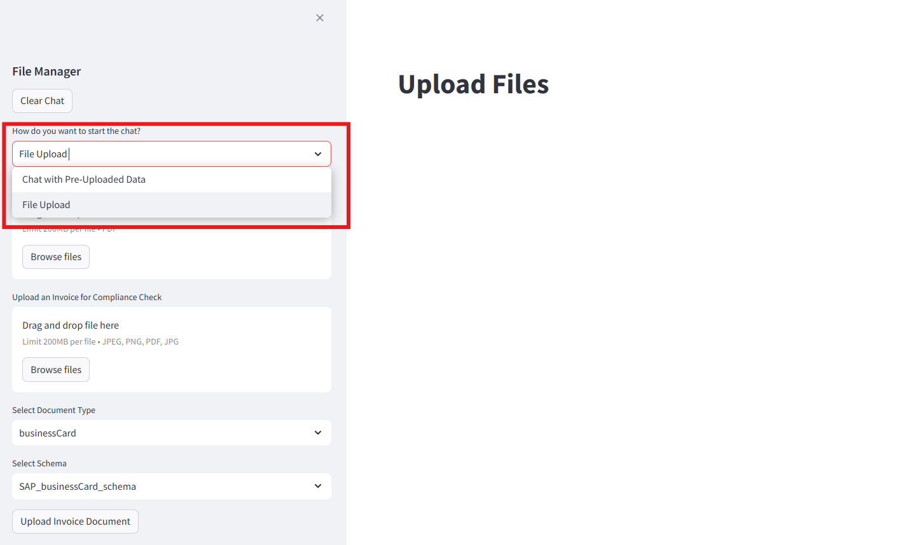
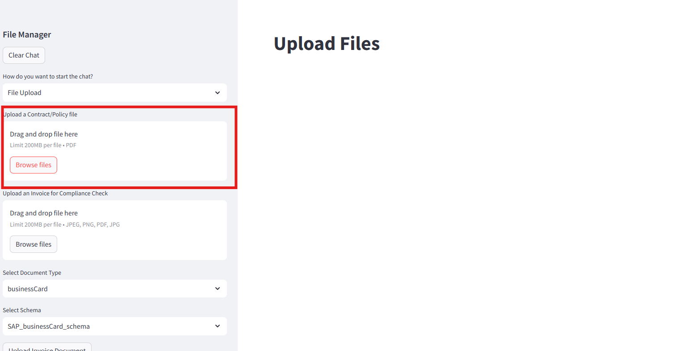

# Understanding the Frontend 

In this section, we will be breaking down the frontend into bite sized code snippets and explain each snippet's functionality. Refer to SAP_RAG_APP/app.py for full frontend code. Refer to README.md to set up application on your local computer. 

## 1: Toggle Page Functionality 



This snippet are all the libraries needed in app.py file. Object store credentials are also loaded from .env file to connect with object store.
```
import streamlit as st 
import functions as func
import os
import boto3
from botocore.exceptions import NoCredentialsError, ClientError
from dotenv import load_dotenv
load_dotenv()

os.environ["AWS_ACCESS_KEY_ID"] = os.environ.get("AWS_ACCESS_KEY_ID")
os.environ["AWS_SECRET_ACCESS_KEY"] = os.environ.get("AWS_SECRET_ACCESS_KEY")
os.environ["AWS_DEFAULT_REGION"] = os.environ.get("AWS_DEFAULT_REGION")
bucket_name = os.environ.get("AWS_BUCKET_NAME")
s3 = boto3.client("s3")
```

This snippet allows users to toggle between Chat interface & File upload interface. 
> First option will be the default page when app starts. 
```
chat_mode = st.sidebar.selectbox("How do you want to start the chat?", ( "Chat with Pre-Uploaded Data","File Upload"))
```

## 2: Upload File Page : Upload Policy Functionality 



This snippet details the UI when user toggles to "File Upload" Page. The app supports only uploading of pdf policy documents but can be easily expanded to other file types if needed. Uploaded file is stored as ``fileContract`` variable.

Upon uploading, ``get_uploaded_docs()`` method retrieves all documents uploaded to object store and extract out only the document titles, then return a list of document titles in object store. This list is stored as ``doc_list`` variable.

If uploaded policy file is not empty nor exist in ``doc_list``, ``fileContract`` will be uploaded to HANA Vector Store via ``call_file_api()`` function to store as embeddings, as well as Object store so we can have a URL link that direct us to the policy document for reference in the future.
```
#if chat by uploading a file
if chat_mode == "File Upload":

    st.title("Upload Files")
    #upload fileof type pdf
    fileContract = st.sidebar.file_uploader("Upload a Contract/Policy file", type=[ "pdf"])

    doc_list = get_uploaded_docs()

    # if file is already exist in db then show message, if not then call the funciton to upload the file into db by vectorize it.
    if fileContract is not None:
        if fileContract.name not in doc_list:
            #Upload to both S3 and Hana vector store
            bucket_name=os.environ.get("AWS_BUCKET_NAME")
            try:
                api_output = func.call_file_api(fileContract)
                fileContract.seek(0)
                st.sidebar.write(api_output["status"])
                s3.upload_fileobj(fileContract, bucket_name, fileContract.name)
                #Update metadata after upload
                s3.copy_object(
                    Bucket=bucket_name,
                    CopySource={'Bucket': bucket_name, 'Key': fileContract.name},
                    Key=fileContract.name,
                    MetadataDirective='REPLACE',
                    ContentDisposition='inline',
                    ContentType='application/pdf'
                )
                st.session_state.file_name = api_output["file_name"]
            except FileNotFoundError:
                st.sidebar.write(f"Error: File '{fileContract.name}' not found.")
            except NoCredentialsError:
                st.sidebar.write("Error: No AWS credentials found.")
            except ClientError as e:
                error_code = e.response['Error']['Code']
                st.sidebar.write(f"Error: {error_code} - {e}")
            except Exception as e:
                st.sidebar.write(f"An unexpected error occurred: {e}")
        else:
            if fileContract.name in doc_list:
                st.sidebar.write("File Name already Exist")
```

``get_uploaded_docs()`` method (in app.py file):
```
#function to get list of uploaded docs from AWS S3 bucket 
@st.experimental_fragment
def get_uploaded_docs():
    bucket_name = os.environ.get("AWS_BUCKET_NAME")
    response = s3.list_objects(Bucket=bucket_name)

    # Safely get list of objects or empty list if none exist
    contents = response.get('Contents', [])
    extracted_titles = [doc['Key'] for doc in contents]

    return extracted_titles
```

``call_file_api()`` method (in functions.py file):
```
#function to call the file upload api
def call_file_api(input_data):
    files = {"file": input_data}
    api_url = "http://127.0.0.1:8000/upload/"
    response = requests.post(api_url, files=files)
    # Check if the response is successful (200 OK)
    if response.status_code == 200:
        try:
            return response.json()
        except requests.exceptions.JSONDecodeError:
            print("Error: Response is not a valid JSON.")
            return None
    else:
        print(f"Error: Received status code {response.status_code}")
        return None
```
We will come back to the implementation of the API in a separate exercise. 

## 3: Upload File Page: Upload documents to check for compliance
