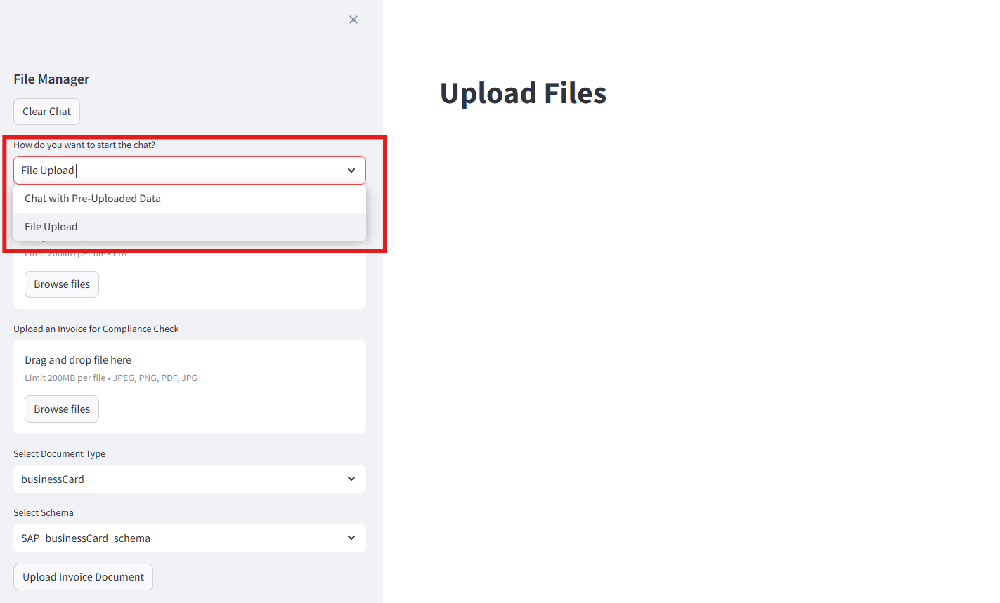
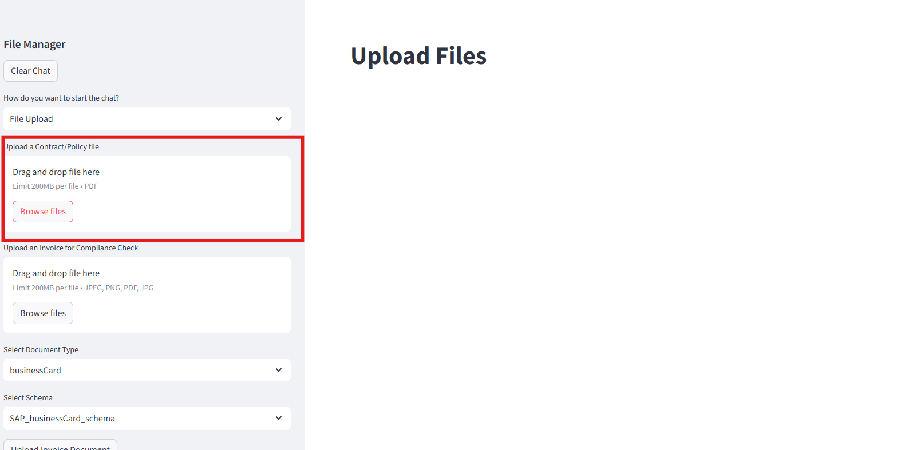
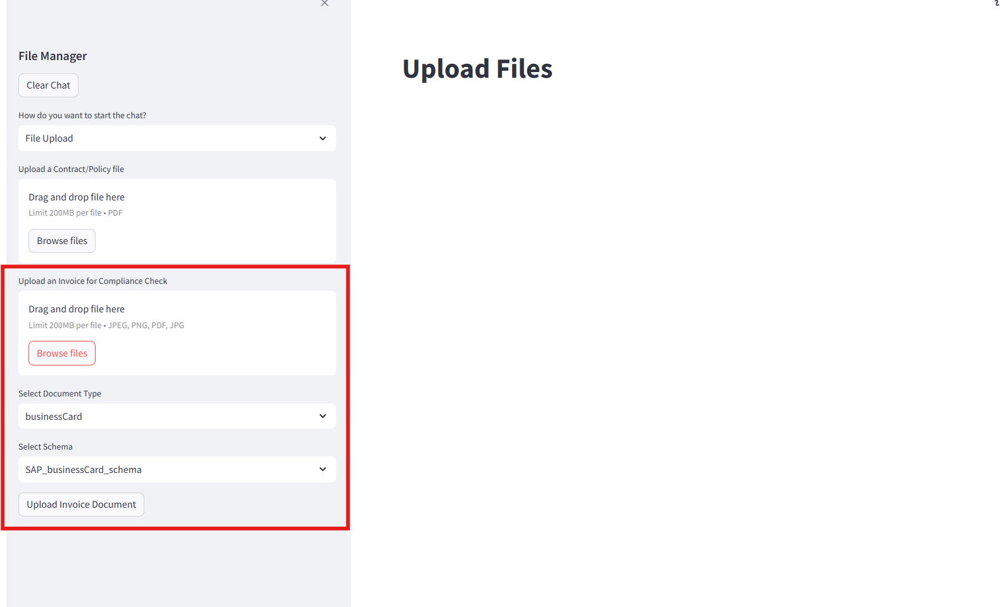

# Understanding the Frontend - Upload Files Page

In this section, we will be breaking down the frontend into bite sized code snippets for the **Upload Files Page** and explain each snippet's functionality. Refer to ``SAP_RAG_APP/app.py`` for full frontend code. Refer to ``README.md`` to set up application on your local computer. 

## 1: Toggle Page Functionality 



This snippet are all the libraries needed in app.py file. Object store credentials are also loaded from .env file to connect with object store.
```
import streamlit as st 
import functions as func
import os
import boto3
from botocore.exceptions import NoCredentialsError, ClientError
from dotenv import load_dotenv
load_dotenv()

os.environ["AWS_ACCESS_KEY_ID"] = os.environ.get("AWS_ACCESS_KEY_ID")
os.environ["AWS_SECRET_ACCESS_KEY"] = os.environ.get("AWS_SECRET_ACCESS_KEY")
os.environ["AWS_DEFAULT_REGION"] = os.environ.get("AWS_DEFAULT_REGION")
bucket_name = os.environ.get("AWS_BUCKET_NAME")
s3 = boto3.client("s3")
```

This snippet allows users to toggle between Chat interface & File upload interface. 
> First option will be the default page when app starts. 
```
chat_mode = st.sidebar.selectbox("How do you want to start the chat?", ( "Chat with Pre-Uploaded Data","File Upload"))
```

## 2: Upload File Page : Upload Policy Functionality 



This snippet details the UI when user toggles to "File Upload" Page. The app supports only uploading of pdf policy documents but can be easily expanded to other file types if needed. Uploaded file is stored as ``fileContract`` variable.

Upon uploading, ``get_uploaded_docs()`` method retrieves all documents uploaded to object store and extract out only the document titles, then return a list of document titles in object store. This list is stored as ``doc_list`` variable.

If uploaded policy file is not empty nor exist in ``doc_list``, ``fileContract`` will be uploaded to HANA Vector Store via ``call_file_api()`` function to store as embeddings, as well as Object store so we can have a URL link that direct us to the policy document for reference in the future.
```
#if chat by uploading a file
if chat_mode == "File Upload":

    st.title("Upload Files")
    #upload fileof type pdf
    fileContract = st.sidebar.file_uploader("Upload a Contract/Policy file", type=[ "pdf"])

    doc_list = get_uploaded_docs()

    # if file is already exist in db then show message, if not then call the funciton to upload the file into db by vectorize it.
    if fileContract is not None:
        if fileContract.name not in doc_list:
            #Upload to both S3 and Hana vector store
            bucket_name=os.environ.get("AWS_BUCKET_NAME")
            try:
                api_output = func.call_file_api(fileContract)
                fileContract.seek(0)
                st.sidebar.write(api_output["status"])
                s3.upload_fileobj(fileContract, bucket_name, fileContract.name)
                #Update metadata after upload
                s3.copy_object(
                    Bucket=bucket_name,
                    CopySource={'Bucket': bucket_name, 'Key': fileContract.name},
                    Key=fileContract.name,
                    MetadataDirective='REPLACE',
                    ContentDisposition='inline',
                    ContentType='application/pdf'
                )
                st.session_state.file_name = api_output["file_name"]
            except FileNotFoundError:
                st.sidebar.write(f"Error: File '{fileContract.name}' not found.")
            except NoCredentialsError:
                st.sidebar.write("Error: No AWS credentials found.")
            except ClientError as e:
                error_code = e.response['Error']['Code']
                st.sidebar.write(f"Error: {error_code} - {e}")
            except Exception as e:
                st.sidebar.write(f"An unexpected error occurred: {e}")
        else:
            if fileContract.name in doc_list:
                st.sidebar.write("File Name already Exist")
```

``get_uploaded_docs()`` method (in app.py file):
```
#function to get list of uploaded docs from AWS S3 bucket 
@st.experimental_fragment
def get_uploaded_docs():
    bucket_name = os.environ.get("AWS_BUCKET_NAME")
    response = s3.list_objects(Bucket=bucket_name)

    # Safely get list of objects or empty list if none exist
    contents = response.get('Contents', [])
    extracted_titles = [doc['Key'] for doc in contents]

    return extracted_titles
```

``call_file_api()`` method (in functions.py file):
```
#function to call the file upload api
def call_file_api(input_data):
    files = {"file": input_data}
    api_url = "http://127.0.0.1:8000/upload/"
    response = requests.post(api_url, files=files)
    # Check if the response is successful (200 OK)
    if response.status_code == 200:
        try:
            return response.json()
        except requests.exceptions.JSONDecodeError:
            print("Error: Response is not a valid JSON.")
            return None
    else:
        print(f"Error: Received status code {response.status_code}")
        return None
```
We will come back to the implementation of the API in a separate exercise. 

## 3: Upload File Page: Upload documents to check for compliance



This snippet details the UI when user toggles to "File Upload" Page (Still within ``if chat_mode == "File Upload":`` if statement). We will be zooming in onto the code to upload documents for compliance check. 

Uploaded document for compliance is stored as ``fileInvoice`` variable. You may expand the file types to other document types supported by Document Information Extraction service. 

``get_dox_document_type()`` method retrieves all unique document types available via DoX API, users are able to select what document type they want to upload to DoX. ``get_dox_schema()`` method retrieves all schemas defined under the chosen document type. This allows the flexibility of uploading documents with custom schemas for extraction.

When the "Upload Invoice Document" button is clicked, ``handle_invoice_upload()`` method is called. This method uploads file to DoX API with chosen document type and schema, and prints out upload status of the document at the bottom of the sidebar. 
```
#if chat by uploading a file
if chat_mode == "File Upload":

    st.title("Upload Files")
    #upload fileof type csv, txt, pdf
    fileContract = st.sidebar.file_uploader("Upload a Contract/Policy file", type=[ "pdf"])
    fileInvoice = st.sidebar.file_uploader("Upload an Invoice for Compliance Check", type=["jpeg", "png", "pdf"])
    dox_doc_type = st.sidebar.selectbox("Select Document Type", (get_dox_document_type()))
    dox_schema = st.sidebar.selectbox("Select Schema", (get_dox_schema(dox_doc_type)))
    
    def handle_invoice_upload():
        file = fileInvoice
        doc_type = dox_doc_type
        schema = dox_schema

        if file:
            invoice_list = get_dox_documents()
            if file.name not in invoice_list:
                api_output = func.dox_upload_file(file, doc_type, schema)
                st.session_state.file_name = api_output.get("file_name")
                if api_output.get("status") == "PENDING":
                    st.session_state.upload_msg = "File is being processed"
                    for message in st.session_state.get("messages", []):
                        with st.chat_message(message["role"]):
                            st.markdown(message["content"])
                else:
                    st.session_state.upload_msg = "Upload Failed"
            else:
                st.session_state.upload_msg = "File Name already Exist"
        else:
            st.session_state.upload_msg = "No file selected"

    # TO DO - add a button to upload the file to DOX
    st.sidebar.button("Upload Invoice Document", key="upload_doc", on_click=handle_invoice_upload)
    
    if "upload_msg" in st.session_state:
        st.sidebar.write(st.session_state.upload_msg)
```

``get_dox_document_type()`` method (in app.py file):
```
@st.experimental_fragment
def get_dox_document_type():
    func.connect_dox_api()
    results = func.dox_get_schemas()
    unique_document_types = sorted({schema.get("documentType") for schema in results})
    return unique_document_types
```

``get_dox_schema()`` method (in app.py file):
```
@st.experimental_fragment
def get_dox_schema(document_type):
    func.connect_dox_api()
    results = func.dox_get_schemas()
    matching_schemas = [
        schema.get("name")
        for schema in results
        if schema.get("state") == "active" and schema.get("documentType") == document_type
    ]
    return sorted(matching_schemas)
```

``dox_upload_file()`` method (in functions.py file):
[DoX API Upload Document](https://help.sap.com/docs/document-information-extraction/document-information-extraction/upload-document)
```
#function to upload file to dox api
def dox_upload_file(file, document_type, schema_name):
    url = os.environ.get("DOXURL") + "document/jobs"
    accessToken = os.environ.get("DOX_ACCESS_TOKEN")

    mime_type, _ = mimetypes.guess_type(file.name)
    if mime_type is None:
        mime_type = 'application/octet-stream'

    headers = {
        "accept": "application/json",
        "Authorization": f"Bearer {accessToken}"
    }
    files = {
        'file': (file.name, file, mime_type), 
        'options': (
            None,
            json.dumps({
                "schemaName": schema_name,
                "clientId": os.environ.get("DOX_CLIENT_NAME"),
                "documentType": document_type,
            }),
            'application/json'
        )
    }
    response = requests.post(
        url,
        headers=headers,
        files=files
    )
    if response.status_code == 201:
        results = response.json()
        return results
    else:
        raise Exception(f"Failed to upload file to DOX: {response.status_code} - {response.text}")
```

[Next Exercise](4-Understanding-frontendpt2.md)