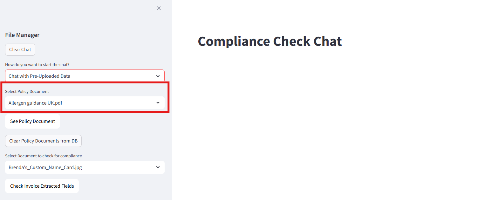
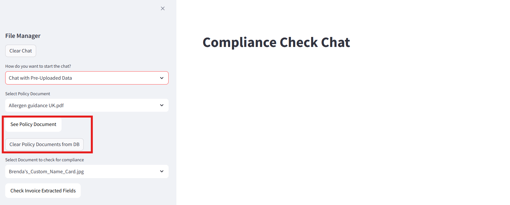

# Understanding the Frontend - Chat interface Page

In this section, we will be breaking down the frontend into bite sized code snippets for the **Chat interface Page** and explain each snippet's functionality. Refer to ``SAP_RAG_APP/app.py`` for full frontend code. Refer to ``README.md`` to set up application on your local computer. 

## 1: Chat interface page : Select Policy Document 



This snippet details the UI when user toggles to "Chat with Pre-uploaded Data" Page. It retrieves a document name list uploaded to Object Store using ``get_uploaded_docs()`` method explain in the previous exercise, and displays it in a drop down box on the sidebar. If ``get_uploaded_docs()`` returns empty list, add "No documents available" into the list. Chosen title in the doc_list will be stored as ``policy_doc`` variable. 
```
# if chat with pre-uploaded docs
elif chat_mode == "Chat with Pre-Uploaded Data":
    st.title("Compliance Check Chat")
    doc_list = get_uploaded_docs() #get list of uploaded docs from db
    # Sidebar dropdown shows only titles
    if not doc_list:
        doc_list = ["No documents available"]
    policy_doc = st.sidebar.selectbox("Select Policy Document", doc_list)
```

## 2: Chat interface page : Select Display & Delete Document 



This snippet details the "***See Policy Document***" and 
```
# if chat with pre-uploaded docs
elif chat_mode == "Chat with Pre-Uploaded Data":
    st.title("Compliance Check Chat")
    doc_list = get_uploaded_docs() #get list of uploaded docs from db
    # Sidebar dropdown shows only titles
    if not doc_list:
        doc_list = ["No documents available"]
    policy_doc = st.sidebar.selectbox("Select Policy Document", doc_list)
    if policy_doc != "No documents available":
        doc_url = generate_presigned_url(policy_doc)
        st.sidebar.markdown(
            f"""
            <a href="{doc_url}" target="_blank">
                <button style="background-color:#FFFFFF;color:black;padding:10px 16px;border:none;border-radius:10px;cursor:pointer;margin-bottom: 20px">
                    See Policy Document
                </button>
            </a>
            """,
            unsafe_allow_html=True
        )
        if clear_data := st.sidebar.button("Clear Policy Documents from DB", key="clear_data"):
            clear_data_db(policy_doc)
    else:
        st.sidebar.info("Please upload a policy document to begin.")


    st.session_state.policy_doc = policy_doc
```