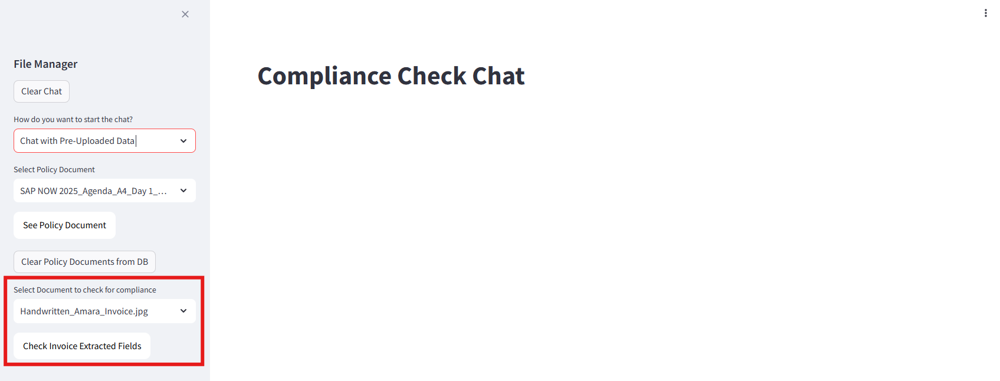

# Understanding the Frontend - Chat interface Page

In this section, we will be breaking down the frontend into bite sized code snippets for the **Chat interface Page** and explain each snippet's functionality. Refer to ``SAP_RAG_APP/app.py`` for full frontend code. Refer to ``README.md`` to set up application on your local computer. 

## 1: Chat interface page : Select Policy Document 


This snippet details the UI when user toggles to "Chat with Pre-uploaded Data" Page. It retrieves a document name list uploaded to Object Store using ``get_uploaded_docs()`` method explained in the previous exercise, and displays it in a drop down box on the sidebar. If ``get_uploaded_docs()`` returns empty list, add "No documents available" into the list. Chosen title in the doc_list will be stored as ``policy_doc`` variable. 
```
# if chat with pre-uploaded docs
elif chat_mode == "Chat with Pre-Uploaded Data":
    st.title("Compliance Check Chat")
    doc_list = get_uploaded_docs() #get list of uploaded docs from db
    # Sidebar dropdown shows only titles
    if not doc_list:
        doc_list = ["No documents available"]
    policy_doc = st.sidebar.selectbox("Select Policy Document", doc_list)
```

## 2: Chat interface page : Select Display & Delete Document 


This snippet details the "***See Policy Document***" button. When a policy document is chosen, it will generate a presigned url of the document in S3 bucket using the boto3 SDK. This url will then be embedded into the "***See Policy Document***" button. URL will expire every 1 hr to ensure security of the document. 
```
    if policy_doc != "No documents available":
        doc_url = generate_presigned_url(policy_doc)
        st.sidebar.markdown(
            f"""
            <a href="{doc_url}" target="_blank">
                <button style="background-color:#FFFFFF;color:black;padding:10px 16px;border:none;border-radius:10px;cursor:pointer;margin-bottom: 20px">
                    See Policy Document
                </button>
            </a>
            """,
            unsafe_allow_html=True
        )
        if clear_data := st.sidebar.button("Clear Policy Documents from DB", key="clear_data"):
            clear_data_db(policy_doc)
    else:
        st.sidebar.info("Please upload a policy document to begin.")


    st.session_state.policy_doc = policy_doc
```

```
def generate_presigned_url(object_key, expiration=3600):
    return s3.generate_presigned_url(
        "get_object",
        Params={"Bucket": bucket_name, "Key": object_key},
        ExpiresIn=expiration
    )
```

This snippet details the "***Clear Policy Documents from DB***" button. When button is clicked and ``clear_data`` variable is ``true``, a dialog asking for re-confirmation before document deletion will appear. Upon clicking the ``Clear Data`` button, it will call the clear data API (implementation will be explained in Exercise 5) which will delete the vectors related to policy document stored in HANA DB, as well as the file object stored in S3 bucket. 
```
if clear_data := st.sidebar.button("Clear Policy Documents from DB", key="clear_data"):
            clear_data_db(policy_doc)
```

```
@st.experimental_dialog("Are you sure?")
def clear_data_db(file = None):
    c1, c2 = st.columns(2)
    with c1:
        if st.button("Clear Data"):
            if file == None:
                mess = func.delete_table(None)
            else:
                s3.delete_objects(Bucket=bucket_name, Delete={"Objects":[
                    {'Key': file}
                ]})
                mess = func.delete_table(file)
            st.rerun()
            return mess
```

## 3: Chat interface page : Select & Check Invoice Extracted Fields 



This snippet details the "***Select Document to check for compliance***" section. ``invoice_list`` variable calls ``get_dox_document`` function. It connects to Document AI api for access token and then retrieves all documents from the connected Document AI instance, extracts the file names and return it as a list.
> More information about SAP Document AI API can be found [HERE](https://api.sap.com/api/document_information_extraction_api/path/get_document_jobs)

If ``invoice_list`` is not empty, it displays a drop down for user to choose the invoice they want to do compliance check on. InvoiceId as well as Fields extracted from the invoice are retrieved from Document AI API. 

Thereafter, we will format the Document AI UI link with the invoiceId supplied, and embed the link to the "***Check Invoice Extracted Fields***" button. This will allow user to be redirected to the Document AI UI to check that extracted fields from the invoice is correct, and make any amends to the extracted fields if needed. 


```
invoice_list = get_dox_documents()
if invoice_list:  # only show invoice-related UI if list is not empty
        invoice = st.sidebar.selectbox("Select Document to check for compliance", invoice_list)
        invoiceId = func.dox_getId(invoice)
        st.session_state.invoice = func.dox_get_fields(invoice)

        url = dox_url(invoiceId)

        st.sidebar.markdown(
            f"""
            <a href="{url}" target="_blank">
                <button style="background-color:#FFFFFF;color:black;padding:10px 16px;border:none;border-radius:10px;cursor:pointer;margin-bottom: 20px">
                    Check Invoice Extracted Fields
                </button>
            </a>
            """,
            unsafe_allow_html=True
        )
    else:
        st.sidebar.selectbox("Select Document to check for compliance", ["No documents available"], disabled=True)
        st.sidebar.markdown(
            """
            <button style="background-color:#CCCCCC;color:black;padding:10px 16px;border:none;border-radius:10px;cursor:not-allowed;margin-bottom: 20px" disabled>
                📄 Check Invoice Extracted Fields
            </button>
            """,
            unsafe_allow_html=True
        )
```

```
def dox_url(invoiceId):
    return f"{os.environ.get('DOX_UI_URL')}clientId={os.environ.get('DOX_CLIENT_NAME')}#/invoiceviewer&/iv/detailDetail/{invoiceId}/TwoColumnsBeginExpanded"


def get_dox_documents():
    #Connect to DOX
    func.connect_dox_api()
    results = func.dox_get_all_documents()
    if results and isinstance(results, list):
        doc_list = [os.path.basename(doc["fileName"]) for doc in results if "fileName" in doc]
        doc_list = list(set(doc_list))  # optional: remove duplicates
        return doc_list
    else:
        return []
```

## 4: Chat interface page : Chat

This snippet details the Chat functionality. A state variable named ``messages`` is instantiated with an empty list right when app is rendered. If there are messages in the state variable, it will show as chat history in the chat interface. 


If user entered something in the chat input and the variable ``prompt`` is true, ``init_chat()`` function will be invoked. This function will add the user question into the list of ``messages``, and then call the Chat API function to retrieve a response from the RAG Pipeline (More to be explained in Exercise 5). It will then display the response on the UI and then save the response as chat history in ``messages`` state variable.


```
if "messages" not in st.session_state:
    st.session_state.messages = []

#load chat history from local history
    for message in st.session_state.messages:
        with st.chat_message(message["role"]):
            st.markdown(message["content"])
    

    # if prompt is not empty then call the function to get response
    if prompt := st.chat_input("Come on lets Chat!"):
        init_chat()
```

```
#function to clear the local chat history
@st.experimental_fragment
def clear_chat():
    st.session_state.messages = []

#function to chat with docs
@st.experimental_fragment
def init_chat():

    #write and save user prompt
    st.chat_message("user").markdown(prompt)
    st.session_state.messages.append({"role": "user", "content": prompt})

    response = func.call_chat_api(prompt, st.session_state.policy_doc, st.session_state.invoice)
    #write and save assistant response
    with st.chat_message("assistant"):
        # st.write("**Context Used for Answering:**")
        # st.markdown(response["context"])
        # Display the final answer
        st.write("**Answer:**")
        st.markdown(response["answer"])
    st.session_state.messages.append({"role": "assistant", "content": response["answer"]})
```

[Next Exercise](5-Understanding-backend.md)