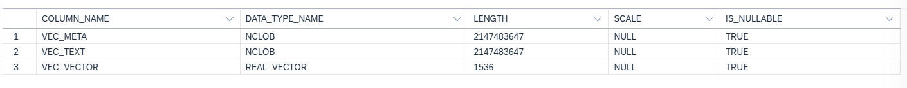

# Understanding the Backend

In this section, we will be breaking down the backend into bite sized code snippets and explain each snippet's functionality. Refer to ``SAP_RAG_API/RAG_api.py`` for full backend code. Refer to ``README.md`` to set up application on your local computer. 

This snippet are the libraries needed in the RAG_api.py file. LLM used to convert text to embeddings will be the OpenAI embedding model deployed in SAP AI Launchpad in [Exercise 2](https://github.com/eliseohh1506/RAGApp/blob/main/EXERCISES/2-Setting-up-env-file.md#step-3-deploy-llm-models--retrieve-deployment-id).
```
from fastapi import FastAPI, File, UploadFile, Form
import os
import api_functions as func
from langchain_community.vectorstores.hanavector import HanaDB
from langchain_community.chat_message_histories import ChatMessageHistory
from gen_ai_hub.proxy.langchain.openai import ChatOpenAI
from gen_ai_hub.proxy.langchain.openai import OpenAIEmbeddings
from dotenv import load_dotenv

load_dotenv()

#initiate fastapi as app
app = FastAPI()

conn = func.get_hana_db_conn()
embeddings = OpenAIEmbeddings(deployment_id=os.environ.get("EMBEDDING_DEPLOYMENT_ID"))
history = ChatMessageHistory()
```

## 1: "/upload" API Endpoint

This snippet details the ``/upload`` API end point implementation that we will call in [call_file_api() function](https://github.com/eliseohh1506/RAGApp/blob/main/EXERCISES/3-Understanding-frontendpt1.md#2-upload-file-page--upload-policy-functionality) 

### Prerequisite - Set up HANA DB Table correctly

> Ensure that you create a new table named "MAV_SAP_RAG". Within this table, you should have 3 columns with the respective COLUMN_NAME, DATA_TYPE_NAME and LENGTH seen below.
> 
> Note that vector length might defer based on the embedding llm model's dimentions produced. OpenAI's text-embedding-3-small model produces 1536 dimensions hence the length. 

In the following function, we first connect to the HanaDB through the langchain hana vector SDK. If the file is in PDF, ``get_text_from_pdf`` function in ``api_functions.py`` is called and a list of the formatted text documents is returned. Currently, this app only supports uploading of PDF files but you can easily extend the file types by creating more functions similar to ``get_text_from_pdf()``. 

If there is documents extracted, ``db.add_documents(texts)`` will convert the document's text into embeddings, and the respective vector embeddings, metadata and the raw text is saved into the HANA DB table. 
```
@app.post("/upload")
async def process_input(file: UploadFile = File(...)): #get file

    #store file temporarily
    file_path = func.get_temp_file_path(file)
    file_extension = os.path.splitext(file_path)[1]
    #create vector connection
    db = HanaDB(embedding=embeddings, connection=conn, table_name="MAV_SAP_RAG")
    texts = []

    if file_extension == ".pdf":
        texts = func.get_text_from_pdf(file_path)
    else:
        return {"status": "File type not supported"}

    print(f"Extracted {len(texts)} chunks from file {file.filename}")

    if not texts or all(doc.page_content.strip() == "" for doc in texts):
        return {"status": "File uploaded, but contains no readable content"}

    db.add_documents(texts)
    return {"status": "Success", "file_name": file.filename}
```

The following function first opens up the PDF, extract the text, formats the text into a Document with the necessary metadata and proceeds to split the documents into chunks with the ``RecursiveCharacterTextSplitter`` while preserving the metadata. In the event that the PDF has images where text is unabled to be extracted by the ``pdfplumer`` library, we will use ``pytesseract``, which is an open source OCR python library to extract the text out of the images. 
```
def get_text_from_pdf(file_path):
    texts = []
    text_splitter = RecursiveCharacterTextSplitter(
        chunk_size=500,
        chunk_overlap=50,
    )

    with pdfplumber.open(file_path) as pdf:
        for i, page in enumerate(pdf.pages):
            text = page.extract_text()
            if not text or text.strip() == "":
                # OCR fallback if no text found
                image = page.to_image(resolution=300).original
                text = pytesseract.image_to_string(image)

            # Create a document with metadata
            doc = Document(id=os.path.basename(file_path), 
                           page_content=text, 
                           metadata={"page": i + 1, 
                                     "title": os.path.basename(file_path)})

            # Chunk this single page-document while preserving metadata
            chunks = text_splitter.split_documents([doc])
            texts.extend(chunks)

    return texts
```

## 2: "/chat" API Endpoint

In this snippet, we will be going through the implementation of the ``/chat`` API. Similar to above, we will first have to instantiate connection with our HANA DB Table. Then, we will also have to instantiate the LLM deployed in [SAP AI Launchpad](https://github.com/eliseohh1506/RAGApp/blob/main/EXERCISES/2-Setting-up-env-file.md#step-3-deploy-llm-models--retrieve-deployment-id) so we can use it in the RAG Pipeline function.

``get_llm_chain()`` returned a compiled langgraph pipeline that can be invoked. It requires the user question, chat history and invoice extracted fields for it to be successfully executed. Thereafter, ``answer`` key in the response generated is used in the [``init_chat()``](https://github.com/eliseohh1506/RAGApp/blob/main/EXERCISES/4-Understanding-frontendpt2.md#4-chat-interface-page--chat) function 
```
@app.post("/chat")
async def process_input(query: str = Form(...), file_name: str = Form("Temp"), invoiceDetails: str = Form({})): #get query and file name

    id = os.environ.get("LLM_DEPLOYMENT_ID")
    llm = ChatOpenAI(deployment_id=id)

    #create vector connection
    db = HanaDB(embedding=embeddings, connection=conn, table_name="MAV_SAP_RAG")

    qa_chain = func.get_llm_chain(llm, db, file_name, invoiceDetails)

    question_with_invoice = {
        "question": query,
        "chat_history": history,
        "invoiceDetails": invoiceDetails
    }
    #get answer
    result = qa_chain.invoke(question_with_invoice)
    return result
```

The ``get_llm_chain`` method builds and returns a RAG pipeline using LangGraph workflow. There are 4 main components to this pipeline. 
1. Prompt template 
    - This provides instructions and context from invoice details, user question and policy document for the LLM to generate a grounded response. Changing the prompt template will change the behavior of the LLM, modifying the response. 
2. Retrieve step in Langgraph workflow 
    - Set up ``retriever`` to perform similarity search with the question and filter retrieved documents to only return documents from the chosen policy file name. 
    - If retriever does not retrieve any relevant documents from Hana DB, return ALL documents from the chosen policy file name. 
    - Update the ``context`` key in ChatState object with the list of relevant documents.
3. Generate step in Langgraph workflow
    - Retrieve the question, chat history and invoiceDetails supplied when the Langgraph pipeline is invoked. 
    - Format the context in prompt template to be a long string where for each document chunk, its metadata details such as ``page`` is followed by the chunk's ``page_content``. This helps to supply necessary policy document context into prompt template for LLM to ground on. Formatting content with metadata details allows LLM to return the page number of the document chunk it used to do compliance check. 
    - Send prompt formatted with ``prompt_template`` to LLM object and use ``invoke`` method to generate a response from the LLM. Return generated response and chat history in a formatted object.
4. Building Langgraph pipeline
    - Use ChatState structure defined and add the retrieve and generate methods in the graph sequence 
    - Start the langgraph pipeline with the ``generate`` method, and feed the output of the ``generate`` method into the ``retrieve`` method.
    - Compile the graph so it can be invoked in the ``/chat`` endpoint. 
```
def get_llm_chain(llm, db, file_name, invoiceDetails):

    # set the prompt templte
    prompt_template = """
    You are a compliance assistant. Based on the extracted invoice fields and the policy document context, answer the user question.

    ### Extracted Invoice Fields:
    {invoiceDetails}
    
    ### Policy Document Context:
    {context}

    ### User Question:
    {question}

    Rules:
    - Answer question directly and concised
    - If no compliance check implied by user question, don't do compliance check
    - Be concise and explain which fields are compliant or non-compliant if asked to compare extracted fields against policy document.
    - Include the **page** for each policy rule you refer to. 
    - Page can be derived from metadata of the page_content where policy is found. If unknown, write 'Unknown'.
    """
    retriever = db.as_retriever(
        search_type="similarity_score_threshold",
        search_kwargs={
            "k": 5,
            "score_threshold": 0.3,
            "filter": {"title": {"$like": "%" + file_name + "%"}}
        }
    )

    class ChatState(TypedDict):
        question: str
        context: List[Document]
        answer: str
        chat_history: List
        invoiceDetails: str

    # Retrieval step
    def retrieve(state: ChatState):
        question = state["question"]
        docs = retriever.get_relevant_documents(question)
        if not docs:
            docs = db.similarity_search("", 100, 
                                        filter={"title": {"$like": "%" + file_name + "%"}})
        return {"context": docs}
    
    # Generation step with memory
    def generate(state: ChatState):
        question = state["question"]
        context = "\n\n".join(
            f"(Page {doc.metadata.get('page', 'Unknown')})\n{doc.page_content}"
            for doc in state["context"]
        )
        invoice_details = state.get("invoiceDetails", "")

        chat_history = state.get("chat_history", [])
        prompt = prompt_template.format(
            question=question,
            invoiceDetails=invoice_details,
            context=context
        )

        response = llm.invoke(prompt)

        # chat_history.append(HumanMessage(content=question))
        # chat_history.append(AIMessage(content=response.content))

        return {
            "answer": response.content,
            "chat_history": chat_history
        }

    # Build the LangGraph
    graph_builder = StateGraph(ChatState).add_sequence([retrieve, generate])
    graph_builder.add_edge(START, "retrieve")
    graph_builder.add_edge("retrieve", "generate")
    graph = graph_builder.compile()

    return graph
```

## 3: "/clear_data" API Endpoint

In this snippet, we will go through the implementation of the ``/clear_data`` API which is used to delete HANA DB embedding chunks relevant to a given policy document in [``clear_data_db``](https://github.com/eliseohh1506/RAGApp/blob/main/EXERCISES/4-Understanding-frontendpt2.md#2-chat-interface-page--select-display--delete-document) function. 

```
def delete_table(filter):
    api_url = "http://127.0.0.1:8000/clear_data/"
    if filter == None:
        response = requests.post(api_url)
    else:
        filter = {"filter": filter}
        response = requests.post(api_url, filter)
    return response
```

``filter`` in this case refers to a policy document name. If there is no file name supplied, all documents in the HANA DB will be deleted. Else documents with the given title will be deleted from the HANA db. 
```
@app.post("/clear_data")
async def clear_data(filter: str = Form("None")): # get filter file name

    #if there is no file name delete all docs in table
    if filter == "None":
        db = HanaDB(embedding=embeddings, connection=conn, table_name="MAV_SAP_RAG")
        db.delete(filter={})
        return {"status": "Success"}
    
    #else delete all docs with that file name in metadata
    else:
        db = HanaDB(embedding=embeddings, connection=conn, table_name="MAV_SAP_RAG")
        db.delete(filter={"title":{"$like": "%"+filter+"%"}})
        return {"status": "Success"}
```