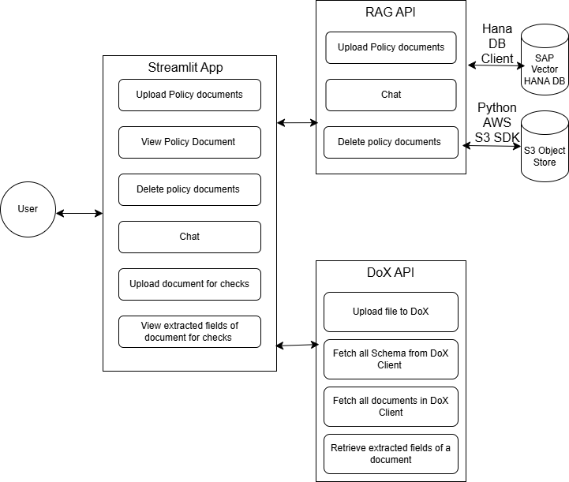
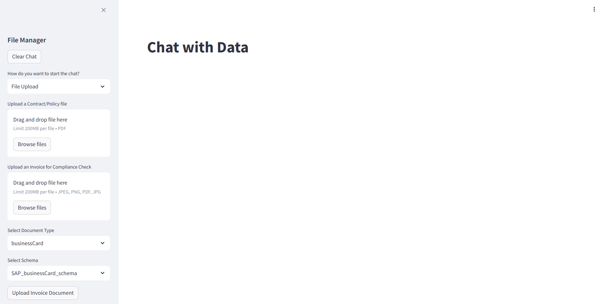
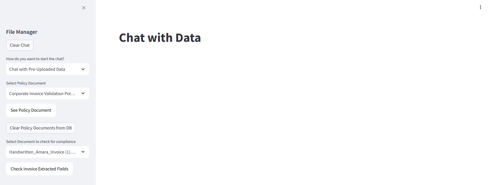

# SAP RAG Chatbot

This is a chat application used to cross check documents against policy to see if documents are compliant 
It uses:
- SAP HANA vector store to store vectors
- S3 Object Store to store documents
- SAP DoX API to upload invoices, retrieve extracted fields
- SAP AI Launchpad LLM models for embeddings and chat
- FastAPI for api, Langchain for DevOps and AI chain
- Streamlit for application.

This application is modified from https://github.com/KARTHIKEYAN-31/SAP-RAG-ChatBot/tree/main, huge thank you for this well built project! 

### Pre-requisite:
Have instance and service key of:
- HANA Vector store 
- S3 Object Store 
- SAP DoX Service 
- SAP AI Core 

You must also make sure:
- LLMs used for embeddings and Chat are deployed on SAP AI Launchpad
- Python version in 3.12

### Structure of Repository:

SAP_RAG_APP:

- app.py - The main application where a document can be uploaded, source document can be viewed, deleted or users can chat with it.
-functions.py - is a extension for both the above mentioned file. Which contains functions, which are called from other files.

SAP_RAG_DOCUMENT_CHATBOT:

- RAG_api.py - It is the main api created using FastAPI, it has the options to load, chat and delete documents from vector DB.

- api_functions - It contains all the functions to create a RAG chain and chat with it and other function used by api file.

Screenshots:
It contains the screenshot of app and how to call it.

requirements.txt:
It contains the libraries required to run the 

### Architecture:

- To upload a policy document to the HANA DB, run app.py > select upload docs from dropdown in sidebar named "Upload a Contract/Policy file" > browse and upload document > switch to "chat with pre-uploaded docs" once "success" message appeared. Upload api is called from app.py where the api gets the file, categorize it, extract pages, convert into vector using embedding llm, and load it into the HANA DB.

- To view policy document, run app.py > switch to "chat with pre-uploaded docs" > Select policy document from dropdown in sidebar > Click on "See Policy Document" button. The policy document should pop up in a new tab as a PDF document. The button embeds a presigned url generated from AWS S3 API

- To upload a document for cross-checking against policy document, run app.py > select upload docs from dropdown in sidebar named "Upload an Invoice for Compliance Check" > browse and upload document > switch to "chat with pre-uploaded docs" once "File is being proccessed" message appeared. Uploading document for cross checking accesses the BTP DoX API and uploads it to a predefined client in the environment.

- To view policy document, run app.py > switch to "chat with pre-uploaded docs" > Select Select Document to check for compliance from dropdown in sidebar > Click on "CHeck Invoice extracted fields" button. This should direct you to Dox UI page where you can check if extracted fields is correct and delete uploaded invoices
  
- To delete policy docs from DB, do all the steps in the above steps. After it click on clear policy documents from DB button to delete selected docs from DB. This will delete its instance and vectors from S3 and Hana Vector Store respectively

### Application Overview:

#### **app.py** 

- To convert the policy file into vectors and upload it into the SAP HANA Vector DB, select File upload in Dropdown > upload document under "Upload a Contract/Policy file" using Browse File. Once the document uploaded "Success" message appears and chat option is enabled.

- To upload an document for checks into DoX UI, Browse File in "Upload an Invoice for Compliance Check". Once document uploaded "File is being processed" message appears. 

- Select "Chat with Pre-Uploaded Data" from dropdown to chat withe the docs already uploaded into the DB. 

- "See Policy Document" button will display source policy document in a pop up as PDF 

- "Clear Policy Documents from DB" will remove policy document from AWS S3 Object Store as well as its vector embeddings in HANA Vector Store 

- "Check Invoice Extracted Fields" will display document for policy check in DoX UI as a pop up, users will be able to edit extracted fields and delete the document through this UI. 

### Clone and try it:

- Create a new folder and nagagitate to it in command prompt (windows).

- Ensure Python version is 3.12.3

- Clone this repository using
    
        git clone https://github.com/eliseohh1506/RAGApp.git

- cd into SAP_RAG_API folder

- Create virtual environment 

- Install required libraries 
    
        pip install -r requirements.txt

- Repeat above 3 steps for SAP_RAG_APP folder
  
- Set the environment variables like hana DB credientials, DOX credentials. View sample_env.txt for format. Rename file as .env with your credentials

- Run api locally by the following command

        uvicorn RAG_api:app --reload

- To run the streamlit application

    * To run the main app which contains options to upload docs, chat with selected docs, delete docs.

                streamlit run app.py 
