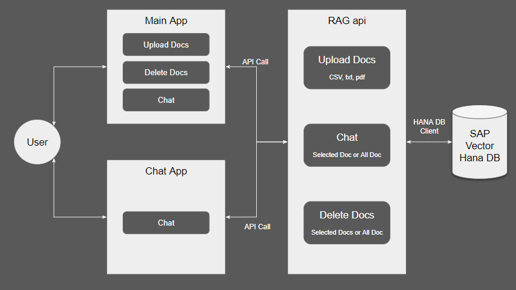
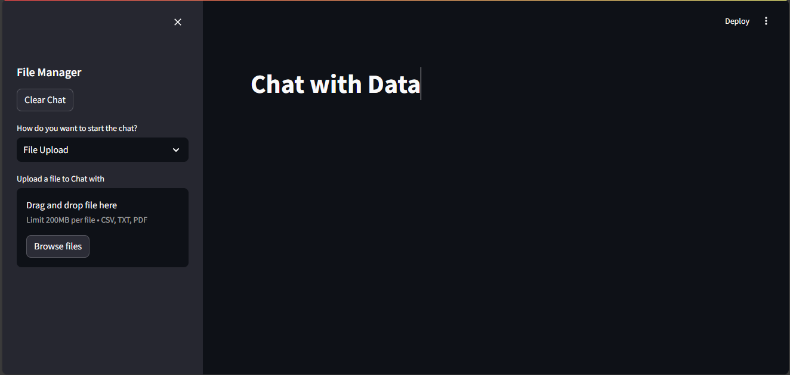
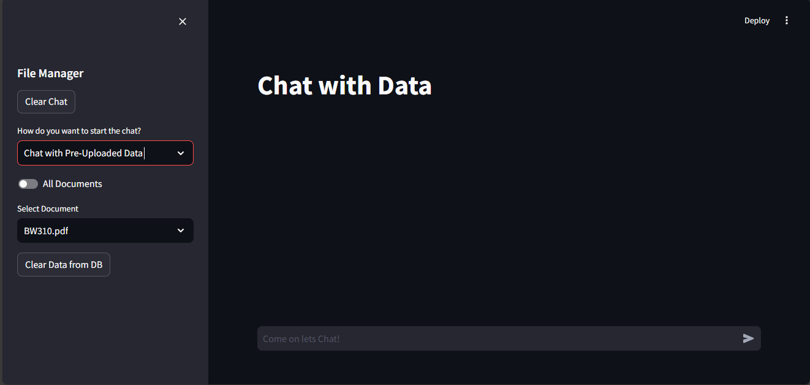
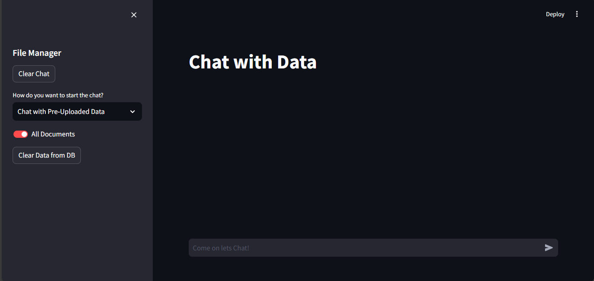
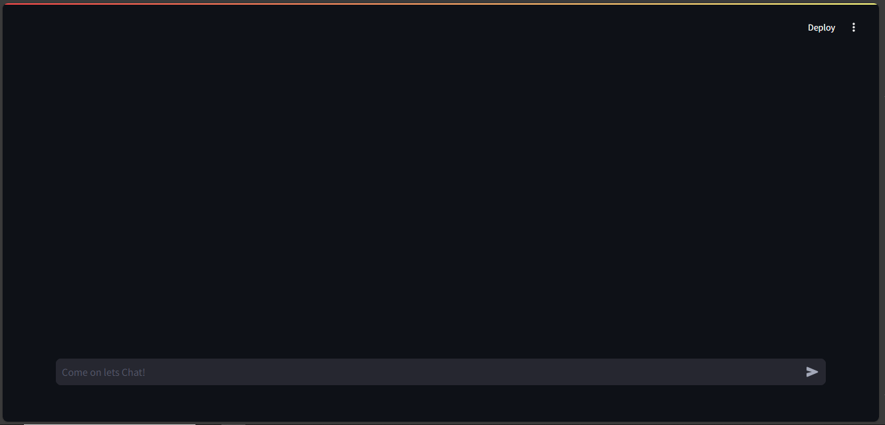
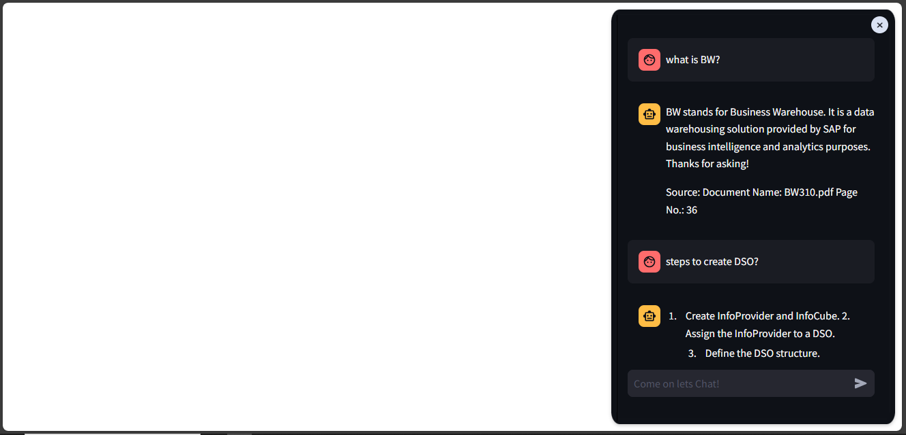

# SAP RAG Chatbot

This is a chat application used to chat with your data in a document.
It uses:
- SAP HANA vector store to store vectors
- Mistral-7B-Instruct-v0.3 as chat LLM
- all-MiniLM-l6-v2 as embeddings LLM 
- FastAPI for api, Langchain for DevOps and AI chain
- Streamlit for application.

### Structure of Repository:

SAP_RAG_APP:

- app.py - The main application where a document can be upload, delete or chat with it.
- iapp.py - is a simple chat interface used to chat with all the documents which are uploaded using app.py.
-functions.py - is a extension for both the above mentioned file. Which contains functions, which are called from other files.

SAP_RAG_DOCUMENT_CHATBOT:

- RAG_api.py - It is the main api created using FastAPI, i has the options to load, chat and delete documents from vector DB.

- api_functions - It contains all the functions to create a RAG chain and chat with it and other function used by api file.

Screenshots:
It contains the screenshot of app and how to call it.

requirements.txt:
It contains the libraries required to run the

### Architecture:

- To upload a document to the HANA DB, run app.py > select upload docs from dropdown in sidebar > browse and upload document > chat once "success" message appeared. Upload api is called from app.py where the api gets the file, categorize it, extract pages, convert into vector using embedding llm, and load it into the HANA DB.

- To chat with pre-uploaded documents, select "chat with pre-uploaded docs" from same drop down mentioned above > select "all docs" toggle to chat with all docs in the DB else select a particualr document from select document dropdown. The chat api is called by giving query and file name as input and get answer, chat-history, extraced - documents.

- To delete docs from DB, do all the steps in the above steps. After it click on clear data button to delete selected or all docs from DB.

### Application Overview:

#### **app.py** 

- To convert the file into vectors and upload it into the SAP HANA Vector DB, select File upload in Dropdown > upload document using Browse File. Once the document uploaded "Success" message appears and chat option is enabled.

- Select "Chat with Pre-Uploaded Data" from dropdown to chat withe the docs already uploaded into the DB. By default a "all document" toggle is dis selected to chat with a particular docs.

- To chat with all docs without selecting a particular data, select "all document" toggle.

#### iapp.py

This is a simple chat UI to chat with all the docs in the hana DB. 

It can be integrate with any application using iframe.

### Clone and try it:

- Create a new folder and nagagitate to it in command prompt (windows).

- Clone this repository using
    
        git clone https://github.com/KARTHIKEYAN-31/SAP-RAG-ChatBot/tree/main

- Install required libraries
    
        pip install -r requirements.txt
  
- set the environment variables like hugging face api, hana DB credientials.

- Run api locally by the following command

        uvirorn RAG_api:app --reload

- To run the streamlit application

    * To run the main app which contains options to upload docs, chat with selected docs, delete docs.

                streamlit run app.py 

    * To run simple app only used to chat, which can be used to integrate with websites using iframe.

                streamlit run iapp.py
